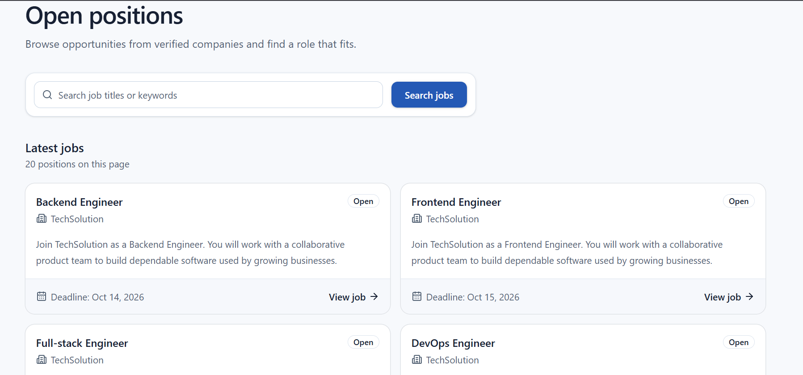
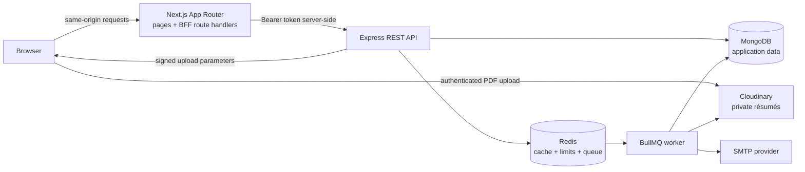

<h1 align="center">JobPortal</h1>

<p align="center">
  A role-based recruitment and applicant-tracking platform built around secure sessions,<br />
  company-scoped authorization, reliable hiring workflows, and background processing.
</p>

<p align="center">
  <a href="https://job-portal-client-virid-three.vercel.app/"><strong>Live demo</strong></a>
  ·
  <a href="#architecture">Architecture</a>
  ·
  <a href="#run-locally">Run locally</a>
</p>

<p align="center">
  
  
  
  
  
  
</p>

<p align="center">
  <a href="https://job-portal-client-virid-three.vercel.app/">
    
  </a>
</p>

## Overview

JobPortal models the hiring journey from public job discovery to interview feedback and final hiring decisions. Applicants maintain profiles, upload private résumés, shortlist roles, and track applications. Recruiters create company workspaces, publish jobs, manage team permissions, and move candidates through a structured pipeline. Administrators moderate companies, users, and listings.

The project was built to practice the backend concerns that appear after basic CRUD: session lifecycle, tenant boundaries, transactional writes, database constraints, caching, rate limiting, background work, private file access, and graceful worker shutdown.

## At a glance

- **3 platform roles:** applicant, recruiter, and administrator
- **4 company roles:** owner, HR manager, recruiter, and hiring manager
- **7 pipeline stages:** applied through hired, with rejection as a terminal path
- **4 worker workflows:** application email, interview notification, résumé processing, and weekly recruiter digest

## Product workflows

### Applicants

- Search and paginate through jobs from verified companies
- Create a professional profile and upload a PDF résumé
- Save jobs to a shortlist and apply to up to ten positions at once
- Submit answers to job-specific screening questions
- Track application stages and upcoming interviews

### Recruiters

- Create a company workspace and invite team members
- Assign company-level permissions independently from platform roles
- Draft, edit, publish, and close job listings
- Review a seven-stage applicant pipeline
- Schedule interviews, record feedback, and access authorized résumés

### Administrators

- Verify or suspend companies
- Review and close job listings
- Suspend or reactivate user accounts
- Keep unverified or suspended organizations off the public job board

## Architecture



Browser JavaScript never needs direct access to backend JWTs. Next.js stores the access and refresh tokens in HttpOnly cookies and forwards the access token to Express from server-side route handlers.

## Engineering highlights

### Authentication and session handling

- Email verification before account activation
- Password hashing with `bcryptjs`
- Short-lived JWT access tokens
- Random refresh tokens stored as SHA-256 hashes in MongoDB
- Refresh-token rotation and server-side revocation
- `HttpOnly`, `Secure` in production, and `SameSite=Lax` cookies
- Authentication-specific Redis-backed rate limits

### Authorization and tenant isolation

- Platform roles and company roles are modelled separately
- Protected routes enforce permissions in the Express API
- Company-scoped operations derive the organization from the authenticated recruiter
- Ownership checks prevent cross-company access to jobs, applications, interviews, and résumés

### Application integrity

- Applicant details are captured as an application-time snapshot
- A compound unique index prevents duplicate applications for the same job
- Multi-job submissions use a MongoDB transaction
- Hiring stages enforce forward-only transitions with terminal states
- Screening answers remain attached to the submitted application

### Performance and background work

- Cursor pagination avoids deep offset scans
- MongoDB text and compound indexes support common job queries
- Redis caches the default public job-board response
- Redis-backed global and authentication rate limits work across server instances
- BullMQ workers use concurrency, three attempts, and exponential backoff
- A scheduled worker prepares weekly recruiter summaries

### Private document handling

- The API signs only authenticated PDF uploads
- Browser uploads go directly to Cloudinary instead of passing through the API server
- Résumé records are confirmed only after upload
- Authorized downloads use signed URLs that expire after five minutes

## Technology

- **Frontend:** Next.js 16, React 19, TypeScript, Tailwind CSS
- **Backend:** Node.js, Express 5, TypeScript, Zod
- **Data:** MongoDB, Mongoose, Redis
- **Async processing:** BullMQ workers and job schedulers
- **Authentication:** JWT, rotated refresh tokens, HttpOnly cookies, bcrypt
- **Storage and email:** Cloudinary authenticated assets, SMTP/Nodemailer
- **Infrastructure:** Docker Compose, MongoDB replica set, Redis

## Repository structure

```text
JobPortal/
├── client/                  # Next.js application and BFF route handlers
│   └── src/app/
│       ├── jobs/            # Public job discovery
│       ├── portal/          # Applicant workspace
│       ├── dashboard/       # Recruiter workspace
│       ├── admin/           # Administration workspace
│       └── api/             # Same-origin backend-for-frontend routes
├── server/                  # Express API and BullMQ worker
│   └── src/
│       ├── modules/         # Auth, applicants, jobs, companies, applications, admin
│       ├── shared/          # Auth, Redis, queues, storage, mail, errors
│       └── worker/          # Background processors and scheduled jobs
├── docs/                    # API and frontend integration documentation
└── docker-compose.yml       # MongoDB replica set and Redis for local development
```

## Run locally

### Prerequisites

- Node.js 20 or newer
- Docker Desktop or compatible Docker Engine
- A Cloudinary account for résumé uploads
- An SMTP provider or local mail server for verification and invitation emails

### 1. Clone the repository

```bash
git clone https://github.com/Rizwaan11/JobPortal.git
cd JobPortal
```

### 2. Start MongoDB and Redis

```bash
docker compose up -d
```

MongoDB runs as a single-node replica set because application submission uses transactions.

### 3. Configure and start the API

```bash
cd server
npm install
cp .env.example .env
npm run dev
```

Update the values in `server/.env` before testing authentication, email, or résumé flows. The API starts on `http://localhost:5000` by default.

### 4. Start the background worker

Open a second terminal in `server/`:

```bash
npm run worker
```

Queued emails, résumé processing, and scheduled recruiter summaries require this process.

### 5. Configure and start the frontend

```bash
cd client
npm install
cp .env.example .env.local
npm run dev
```

Open `http://localhost:3000`.

> PowerShell users can replace `cp` with `Copy-Item`.

## Environment configuration

The checked-in example files document every required key. Important groups include:

- **Database and queue:** `MONGO_URI`, `REDIS_URL`
- **Authentication:** `JWT_SECRET`, access-token lifetime, refresh-token lifetime
- **Email:** SMTP connection, sender address, OTP and invitation lifetimes
- **Application URLs:** frontend origin and link-generation base URL
- **Traffic controls:** cache lifetime and rate-limit settings
- **Cloudinary:** cloud name, API key, and API secret

Never commit real secrets. The browser does not need a public backend URL; the Next.js server reads `API_URL` and talks to Express on the user's behalf.

## Health checks

- `GET /health` confirms that the API process is responding.
- `GET /ready` checks both MongoDB and Redis connectivity.

## Useful commands

### Client

```bash
npm run dev
npm run lint
npm run build
```

### Server

```bash
npm run dev
npm run worker
npm run typecheck
npm run lint
npm run build
```

## Documentation

- [Product workflows](#product-workflows)
- [Architecture](#architecture)
- [Engineering highlights](#engineering-highlights)
- [Local setup](#run-locally)

## Engineering roadmap

The next improvements are intentionally focused on evidence and operational reliability rather than adding more surface-level features:

- Integration tests for authentication, ownership boundaries, duplicate applications, and stage transitions
- End-to-end tests for the applicant and recruiter journeys
- GitHub Actions for linting, type checking, tests, and production builds
- Idempotent background jobs and an outbox-style handoff between database writes and queues
- Queue metrics, centralized error reporting, and production observability
- Pagination for administrator lists

## Project status

This is a portfolio and learning project built to demonstrate full-stack delivery and backend design decisions. It is not presented as a security-audited production service. The [live demo](https://job-portal-client-virid-three.vercel.app/) is available for exploring the implemented workflows.

## Author

**Muhammad Rizwan Ali**

- [GitHub](https://github.com/Rizwaan11)
- [LinkedIn](https://www.linkedin.com/in/m-rizwanali21)
